# 【柠檬音乐 v1.2.9】找歌下载 · 标签整理 · 本版标签体验升级

> **发帖说明**  
> 1. 正文可直接复制到飞牛社区。  
> 2. **配图文件**在仓库 `docs/screenshots/*-v1.2.9.png`；发帖时请按下方顺序上传同名截图。  
> 3. **阅读顺序**：先看下载 + 改标签（新人主流程），再看本版加强与其它功能。

---

大家好，**柠檬音乐**（飞牛应用中心显示名）发布 **v1.2.9**。

这是面向飞牛 NAS 的 **Web 音乐工具**：多平台搜歌、试听、批量下载，再把本地文件的标题 / 歌手 / 封面 / 歌词整理好。兼容落雪 / 澜音自定义音源脚本。

**给新人一句话**：先用它 **把歌下到 NAS**，再用 **标签编辑** 把文件信息补全、改对——日常整理就这两步。

应用为**原生 FPK**，不依赖 Docker，运行依赖应用中心 **Node.js v22**。

**GitHub Release**：https://github.com/jia070310/lemon-muisc/releases/tag/v1.2.9  
**仓库地址**：https://github.com/jia070310/lemon-muisc

---

## 一、核心能力：下载（找歌 → 落到磁盘）

适合：想把喜欢的歌稳定下到飞牛本地目录。

### 1. 搜索：多平台检索与单曲 / 批量下载

在「搜索」选平台（酷狗 / 酷我 / QQ / 网易云等，取决于你激活的音源），关键词检索后可试听、加入列表，或点下载 / **批量下载**。

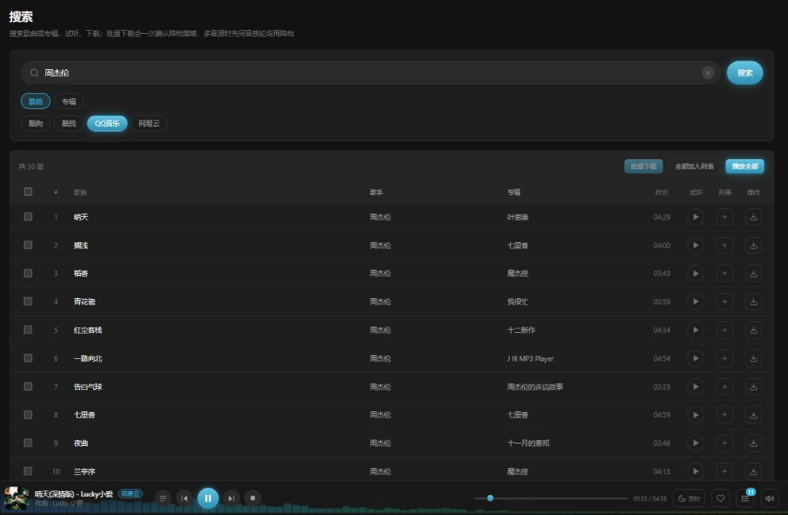

### 2. 发现：粘贴歌单链接或浏览热门歌单

「发现」可粘贴各平台歌单链接，或浏览最热 / 最新歌单，再试听、批量下载（会一次确认降档策略）。

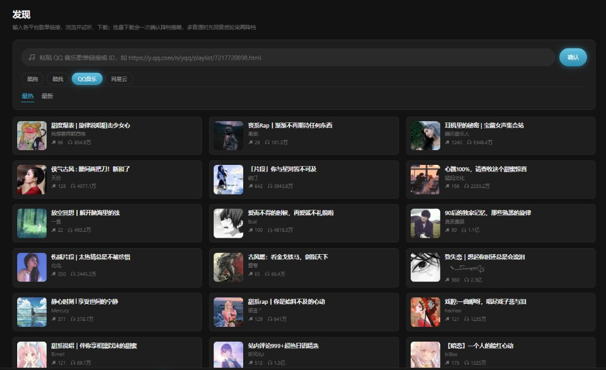

### 3. 下载管理：队列、筛选、试听失败重试

- 任务进度、暂停 / 继续、移出列表 / 删文件  
- **同名文件**：询问 / 跳过 / 覆盖  
- 可按歌手 / 专辑建子文件夹；内嵌封面、歌词或独立 `.lrc`  
- **试听时长拦截**：实际时长明显短于完整曲会取消并提示，可换源重试；支持「试听失败」筛选与批量重试  

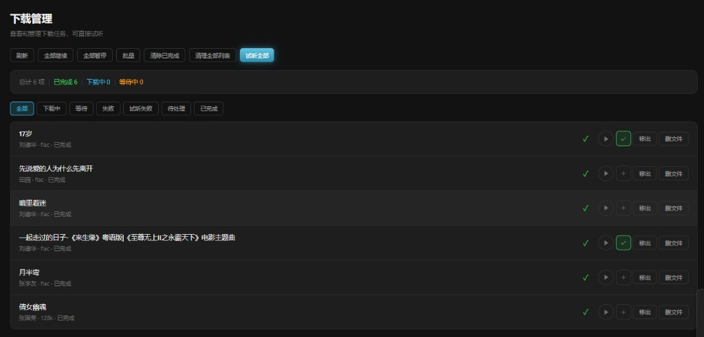

**建议流程**：设置里配好下载目录与音源 → 搜索 / 发现点下载 → 到「下载」页确认是否成功。

---

## 二、核心能力：标签编辑（整理本地文件信息）

适合：文件已在 NAS 上，但歌名乱、缺封面 / 歌词，或内嵌信息和文件名对不上。

### 1. 三栏编辑：目录 → 列表 → 单曲信息

左侧选文件夹，中间看文件与批量工具，右侧改标题 / 歌手 / 专辑 / 封面 / 歌词。支持「匹配缺失 / 匹配选中」「按文件名重设全部」「手动检测」。

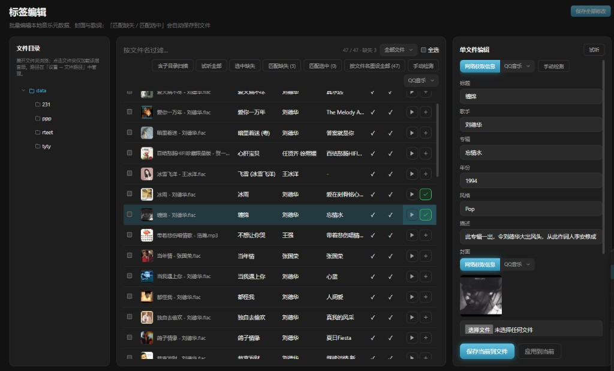

### 2. 手动检测：标黄不正确标签，一键采用（含封面 / 歌词）

按文件名（歌手-歌名 / 歌名-歌手）搜索并对比内嵌信息；不对的字段**标黄**；「全部采用建议」可连同封面、歌词一起改，再点「保存当前到文件」。

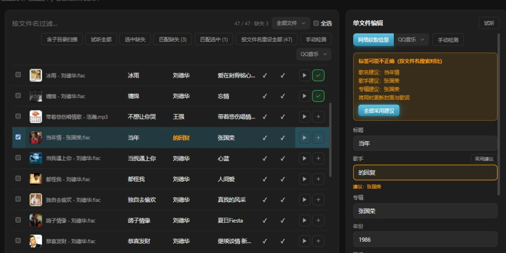

### 3. 本版标签相关加强（务必看）

- **按文件名重设全部**：整夹按文件名重新匹配并保存（有确认）  
- **标签匹配并发**：设置 → 音源管理，1–6 路（默认 3）；越高越快，过高可能被音源限流  
- **保存防护**：「保存当前到文件」**只写正在编辑的那一首**；批量套用须先「应用到选中」（会确认）再「保存全部修改」  

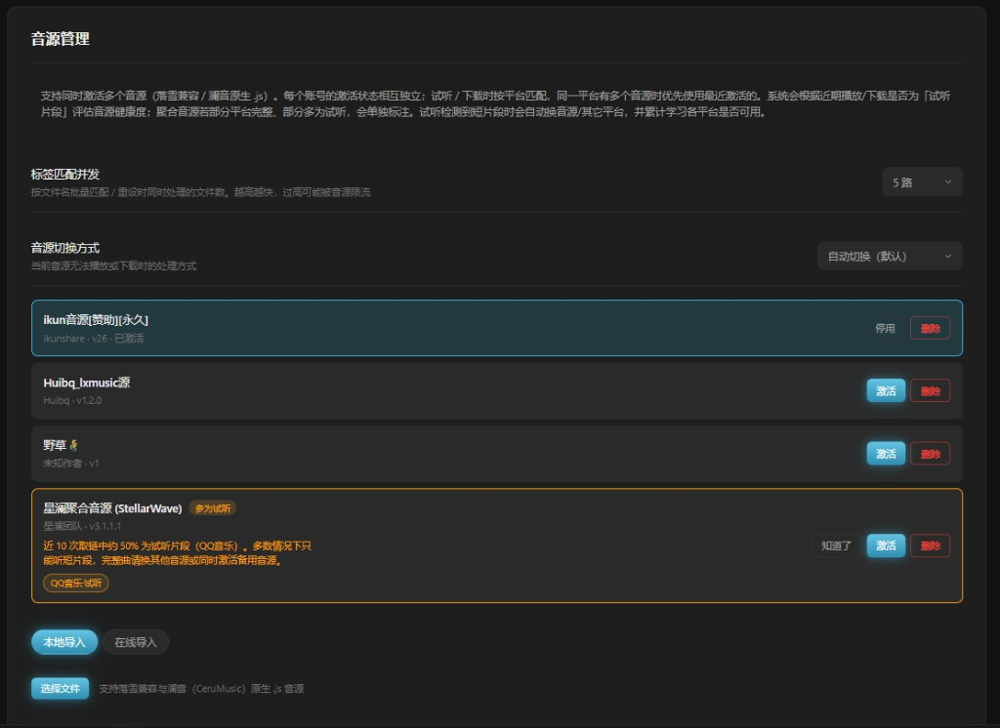

**建议流程**：设好音乐库路径 → 标签编辑选文件夹 → 匹配 / 手动检测 → 确认后再保存。

---

## 三、本版相对 v1.2.8：改了什么？

| 类别 | 说明 |
|------|------|
| **标签布局** | 窄屏 / 手机自适应；底部编辑抽屉；工具栏可换行 |
| **手动检测** | 按文件名对比内嵌标签，标黄 + 建议（可连封面歌词） |
| **按文件名重设全部** | 整夹重刷标签并落盘 |
| **匹配并发** | 有限并行；设置可调 1–6 |
| **保存安全** | 默认只保存当前曲；批量应用需确认 |
| **查重** | 优先按文件名解析分组，减少错误标签误报 |

下载、试听换源、睡眠定时、查重删文件、账号备份等 **v1.2.8 能力继续保留**。

---

## 四、其它功能（下载与改标签之后再用）

### 试听：短片段提示与自动换源 / 换平台

播放若仅为试听短片段，会提示；系统尽量自动换同平台其它音源，再换其它平台搜同名曲，完整后继续播。

| 试听片段提示 | 已切换完整播放 |
|--------------|----------------|
| 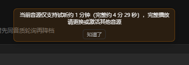 |  |

### 音乐库 · 全屏播放 · 风格与路径

本地扫描后浏览歌单 / 专辑；全屏可看封面、歌词与频谱；设置里管路径与主题。

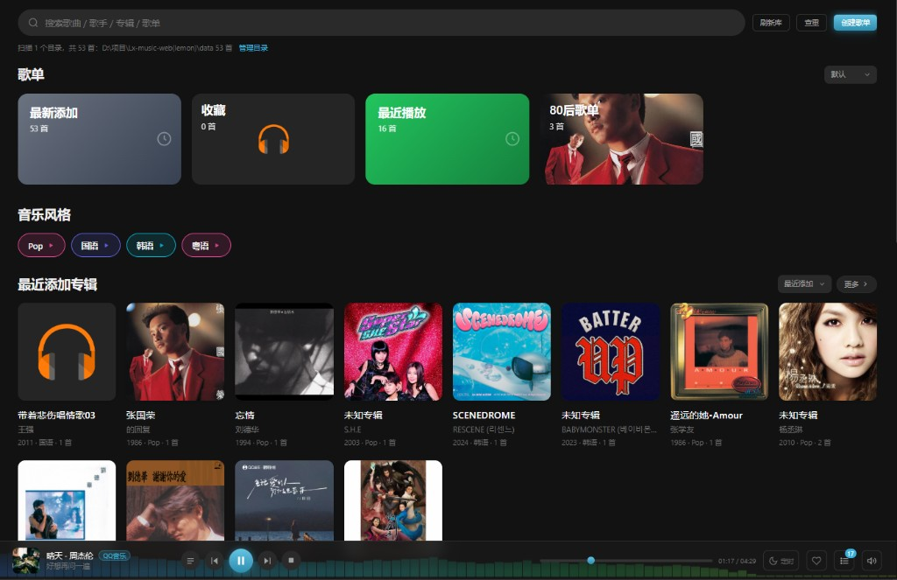

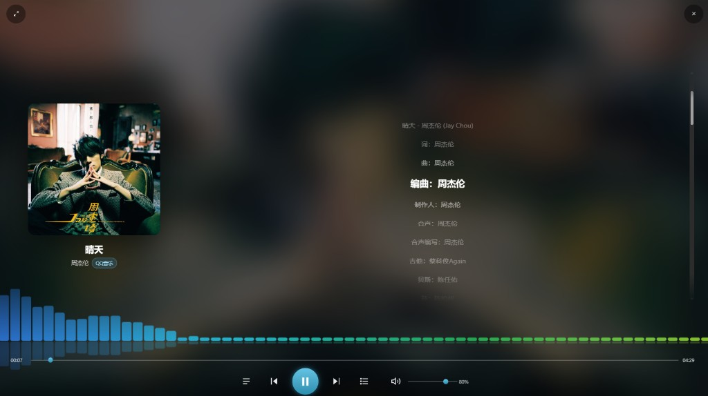

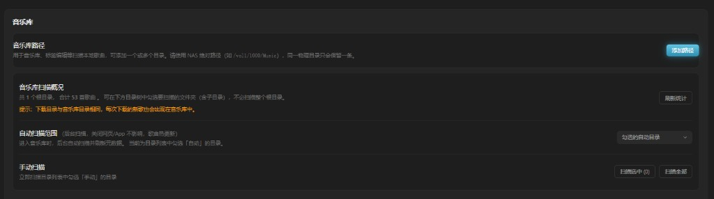

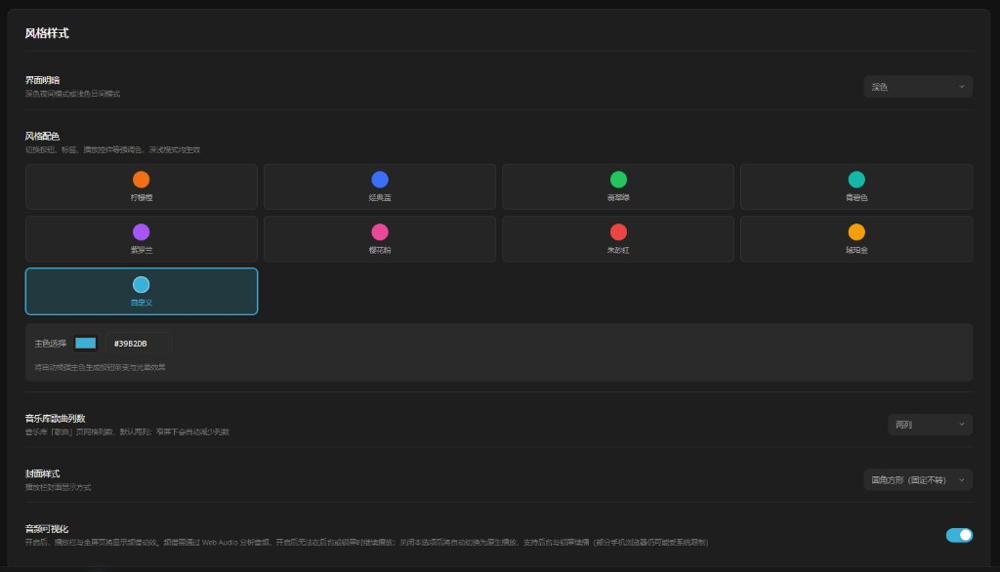

---

## 五、安装与使用提示

1. 应用中心安装 **Node.js v22**，再安装柠檬音乐 FPK（x86 / arm 选对应包）。  
2. **设置 → 音源管理**：导入并激活音源（可多开）；注意「多为试听」健康度提示。  
3. **设置 → 文件路径**：音乐库目录建议与下载目录一致，下完的歌会直接出现在库里。  
4. 标签批量匹配并发别开太高，避免被音源限流。  
5. 请仅用于个人已合法授权的资源；遵守当地法律与各平台条款。

有问题欢迎回帖说明机型、架构（x86 / arm）与截图，方便排查。

---

**配图清单（发帖上传顺序建议）**

1. `search-v1.2.9.png`  
2. `discover-v1.2.9.png`  
3. `download-v1.2.9.png`  
4. `tag-editor-v1.2.9.png`  
5. `tag-manual-check-v1.2.9.png`  
6. `source-health-v1.2.9.png`  
7. `preview-clip-dialog-v1.2.9.png` / `preview-switched-v1.2.9.png`  
8. `library-v1.2.9.png` / `fullscreen-v1.2.9.png` / `paths-v1.2.9.png` / `appearance-v1.2.9.png`  
